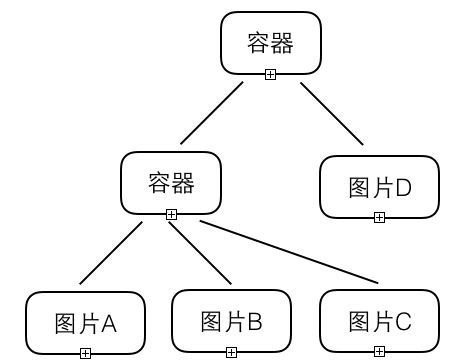
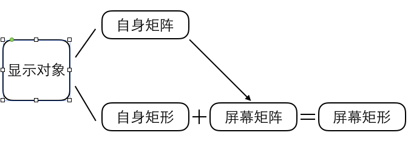
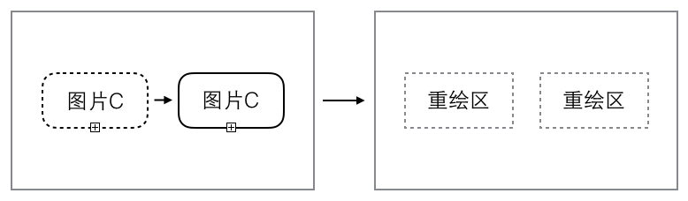
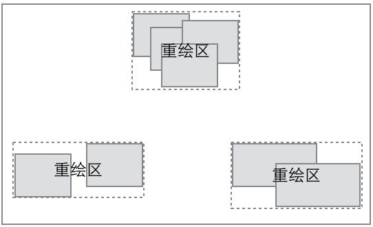

这篇文章主要讲解显示列表与脏矩形渲染的基础概念，并不涉及具体的代码，应该只需要简单的数学知识就能完全明白。了解这部分内容有助于理解屏幕的基本渲染过程，对实际开发中确定性能优化方向可能也会有帮助。

## 什么是显示列表？

在2D图形渲染中，显示列表是非常成熟的一种渲染组织方式，它封装了晦涩难以操作的底层绘图接口，提供给开发者一套非常简易且高效的API，来组织显示元素最终呈现到屏幕上。如下图，是一个简单的显示列表示例。

显示列表是一个树状的结构，列表中的每个节点叫做显示对象。显示对象分为两类，一类是普通显示对象，另一类是容器显示对象。容器显示对象可以在内部再包含其他的显示对象（普通或容器）。可以将容器显示对象类比为一个盒子，里面放上其他的显示对象。当你移动容器时，它内部的子项也会整体跟着移动，当你缩放容器时，它内部的子项也会整体跟着缩放。显示列表就是这样一层一层嵌套而成的数据结构。容器通常都只起到整体定位作用，并不呈现图像。在末端叶子节点的普通显示对象通常是图片，可以显示到屏幕上。当然可以显示的节点也有可能是文本或矢量图，为了简单起见，这里都以图片为例。一个图片节点的所有父级容器上的定位或缩放信息，最终都会应用到这个图片上，用来确定图片在屏幕上最终的显示位置和区域大小。

## 全屏刷新渲染

基于显示列表结构的渲染方式，最常的就是全屏刷新模式。这也是目前大多数游戏引擎普遍采用的方案，因为不管是原理还是实现都比较简单：首先设定一个时钟频率，例如通常是每秒执行60次。每次都单独刷新一次屏幕。刷新过程就是直接清空整个屏幕，然后从显示列表的根节点开始遍历，按顺序找到每个可呈现的显示对象节点，按照它的坐标和大小绘制到屏幕上。这样开发者只需要改变显示对象的位置属性，等待下一次时钟周期到来，改变就会自动刷新到屏幕上。由于通常情况下，并不是每秒60次显示列表每次都会发生改变，或者发生改变时仅有一小部分改变。因此清空整个屏幕重绘的方式虽然实现简单，但是不必要的开销比较大。

## 脏矩形渲染原理

脏矩形渲染是一种基于显示列表的局部刷新方法。依然是要有一个时钟频率，定时每秒执行60次。但区别是每次我们并不直接清空整个屏幕，而是首先计算屏幕上发生改变的区域，这里我们叫做重绘区，然后只清空指定的重绘区，并找出跟这个区域相交的所有显示对象重绘一遍。如果显示列表本次美并没有发生改变，那么将直接跳过本次绘制，什么也不做。

接下来，局部刷新算法的重点就集中在了如何获取重绘区上。

如上图，每个显示对象在屏幕上都对应一个矩形区域。通常它自身都包含两个属性：自身矩阵和自身矩形。自身矩阵代表这个显示对象在父级容器中的位置，缩放等变换信息，也就是开发者最通常操作的部分。自身矩形是固定测量出来的一个四边形，如果是一个图片，自身矩形等于这个图片未缩放时的原始大小区域。自身矩形和自身矩阵叠加，会得到这个显示对象在它父级容器里变换后（例如位移或缩放）的矩形区域。但是为了能统一比较，我们需要获取每个显示对象在屏幕上的矩形。那么首先是要获得这个显示对象相对于屏幕的矩阵信息，屏幕矩阵等于自身矩阵和所有父级容器的矩阵相乘结果。最后用屏幕矩阵跟自身矩形叠加就能得到屏幕矩形。

获取到每个显示对象在屏幕上的矩形区域后，我们下一步是需要一个通知机制，每当这个显示的对象的屏幕矩阵和自身矩形发生改变的时候，就重新计算一次屏幕矩形。这时候就能得到两个矩形：这个显示对象改变前在屏幕上的矩形，和改变后在屏幕上的矩形。这两个矩形就是要获取的重绘区。

如上图，一张图片从屏幕的左边移动到了右边，那么这个操作会产生左右两个需要重绘的区域。将两个区域都清空，并根据图片新的位置绘制到新区域上，这样图片就从旧位置移动到了新位置。

上图是单个显示对象移动的情况，缩放的情况也可以此类推。但实际情况中，每次刷新时并不只有一个显示对象改变，可能会产生无数个可能相交的重绘区域。最简单的范式是直接把这大量的矩形依次拿去重绘，分别执行清空矩形，然后查找相交的对象重绘。显然重绘区数量过大的时候，会造成巨大的开销。因此我们还需要对得到的重绘区列表进行合并。这里就进入到了脏矩形算法的核心了，合并的算法规则是：

**1.如果两个矩形合并后总面积小于两个矩形各自面积之和，则允许合并，并且优先合并相交面积最大的两个矩形。**

**2.合并到最后，若规则1已经不满足，但是剩余矩形总数量大于3，则强制继续合并。并优先合并面积增加量最小的两个矩形。**

剩余矩形总数为什么控制为3以内？这其实是一个测试结论，把合并到最后重绘区数量控制为三个以内的时候是最佳的平衡点。既不会对接下来的重绘操作带来压力，也足够覆盖大部分的局部刷新情况。 

如上图，屏幕上有大量的重绘区域，我们根据刚刚的合并原则， 能够得出最终的三个重绘区。注意一下左下角的重绘区，实际上内部两个矩形并没有相交。也就是说他们合并后的矩形肯定大于各自的面积之和。这里正是使用了规则2将其合并的。再极端一些，整个屏幕布满了零碎的矩形都不相交，那么这个算法结果会得到唯一的一个全屏矩形。这样正好符合全屏刷新的需求，能让这个合并算法同时适应局部刷新和全屏刷新的情况。

到这里的话，脏矩形渲染的原理就算讲解完了，其实更加复杂的是cacheAsbitmap等接口的设计，但限于篇幅在此就不赘述了。

## 脏矩形渲染优势

显而易见的是它能大幅提高屏幕整体渲染性能，特别是对于复杂UI界面的情况，全屏刷新算法会每秒60次不停地刷新所有UI对象，在有脏矩形渲染的情况下，哪改变绘制哪，极端情况直接跳过绘制，在复杂UI界面的情况非常容易达到满帧。另外脏矩形渲染能够节省设备电量以及降低发热量。我们曾经测试过同一个线上游戏，在更新到脏矩形渲染后，整体耗电量降到了原先的30%，发热量也从45度降低到了35度，结果是非常显著的。

## 脏矩形渲染FAQ

这里有几个问题是经常被问到的，统一整理一下回答。

**1.都说脏矩形渲染性能高，但我写了个全屏动画的测试对比发现脏矩形渲染并没有全屏刷新性能高，这是怎么回事？**

答：在知乎上也有人对React提过一模一样的问题，是写了个操作Rect和直接操作DOM的性能对比，结果发现React比较差。脏矩形渲染其实跟Rect优化原理类似，都是针对实际项目的使用情况去优化，牺牲1%以下的计算性能，换取多数情况下成倍的性能提升。所以天生在某些极端测试中是有劣势的，但是实际项目里很少会出现这种极端测试的情况。排除调用方式的问题，你如果写个全屏无数动画同时播放的性能对比测试，脏矩形渲染是会全屏刷新模式差，但也不会特别明显，有个一两帧的差距。而且这个差距还在逐渐缩小，我们会做一些优化，在接近全屏渲染情况时自动放弃后续的计算而采用全屏刷新方式。总之这种测试并没有什么实际的参考意义，还是应该看实际项目中的整体帧率。

**2.浏览器本身就有脏矩形渲染，自己再实现一遍有什么意义吗？**

答：浏览器里大体可以分为两大类接口集合，第一类是偏向上层的以HTML/CSS为主的页面排版接口，第二类是偏向底层的以Canvas/WebGL为主的绘图接口。第一类是具有原生的脏矩形渲染，但是由于功能体系过于庞大，加上本身也是设计给偏向静态的页面排版使用的，性能上第一类远远不及第二类。因此偏向高动态交互的游戏引擎，全都选择了基于第二类接口，从最底层开始构建高性能的渲染，其实这种方案跟原生开发的界限已经很模糊了，也更容易实现跨平台移植。早期没有脏矩形渲染的时候，甚至尝试过讲HTML/CSS覆盖在Canvas上做UI部分的方案，但是混合的性能并不好，并且还有各种兼容问题。综上，所以实现脏矩形渲染是非常必要的。

